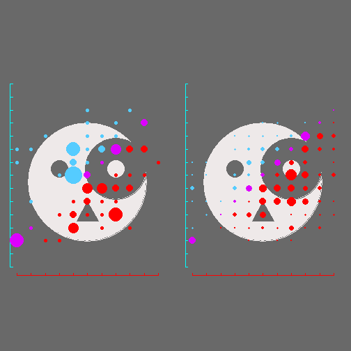
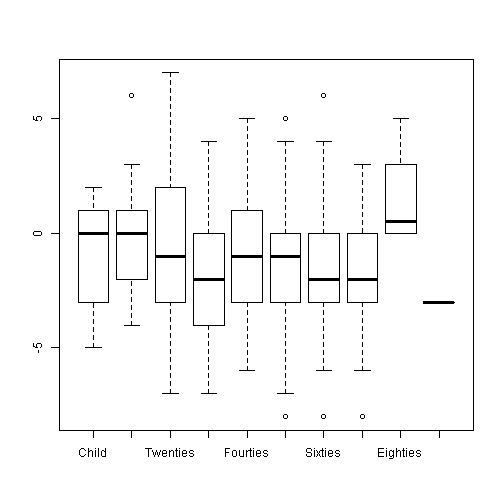

Lia Cook Weave vs Photo: Statistics
===========================================

### By Bradley Shanrock-Solberg 3-Jan-2016

Synopsis
--------

The primary goal of the study was to look for whether a print of the photo vs a weave of the photo caused changes in emotional intensity (0-10 scale, 10 = high) and whether the emotion felt was a negative or positive emotion (negative = 0, positive = 10).

The experiment was controlled so that roughly half of the subjects saw the photo first, and the other half the weave first.

The subjects varied widely in experience with science, art, weaving and photography, and had a broad range of age and education, although of course all were the sort of people who would show up to an art exhibit and participate in a survey.

The tests showed that the most consistent factor was that if Photo was viewed first, a larger relative negative emotion would be felt when the Weave was viewed.  The reverse was not true.

The Pittsburgh test showed an increase in emotional intensity for the Weave for age groups 30-50.

The Houston test showed an increase in positive response to the Weave for age groups 30-50, and an increase in negative emotional response to the Weave for people with prior Art experience.

When these significant effects were fitted to a model attempting to explain the response, the Pittsburgh intensity response by age showed no patterns between tests and did not provide a satisfactory model compared to "noise".  The negative-positive response, by contrast seemed to provide a better fit if age was considered in addition to the First Viewed factor.  In both tests, the Child and Age 40-49 cohorts showed stronger positive emotions to Weave compared to all other age groups.

After adjusting the data for the bias caused by First Viewed, key age breakpoints emerged in both studies,
* In Pittsburgh, subjects over 50 responded more negatively to the Weave than those under 50
* In Houston, subjects over 30 responded more negatively to the Weave than those under 30
* The Pittsburgh subjects had significantly more under 30 than Houston, and Houston had significantly more over 50 than Pittsburgh, explaining the differences seen in their overall reaction
* As the art was different in Pittsburgh vs Houston, there is no way to generalize results further across both location

The three key populations of each study will be used as a basis for data visualizations:
* Total population by location
* Population Older Than Key Age Breakpoint for Location
* Population Younger than Key Age Breakpoint for location

Approach
--------
First, a small series of paired student T-tests were done to establish whether there was any significant difference in responses for individuals between the photo and the weave.  

Second the difference in Weave response minus Photo response was measured, as that captures the individual response, with a positive number indicating a better response to the Weave, negative a better response for Photo.  This number allows a unpaired t-tests  of change in response among subsets, comparing different age groups, or experience to see if the response was different.

Finally a linear model attempting to fit the responses to a curve was created, eliminating parameters that did not show any impact in the T-tests and the fit was checked using Analysis of Variance (ANOVA) to see if adding parameters improved the fit.


Student T-Test of Equivalence
-----------------------------

When significant differences were found, a histogram of the views is shown.
pdata = Pittsburgh data, hdata = Houston Data.  Different photographs were used in both, the same image is used in Photo and Weave for the test.

If p-value is below .05, the hypothesis that both values are the same is considered to be disproved.

The function lc.dhist is shown in the appendix at the end of this document.

### Photo vs Weave Paired Tests, Entire Population

```r
t.test(pdata$Photo_Intensity, pdata$Weave_Intensity, 
       paired = TRUE)$p.value
```

```
## [1] 0.5622718
```

```r
t.test(hdata$Photo_Intensity, hdata$Weave_Intensity, 
       paired = TRUE)$p.value
```

```
## [1] 0.659176
```

```r
t.test(pdata$Photo_Neg_Pos, pdata$Weave_Neg_Pos, 
       paired = TRUE)$p.value
```

```
## [1] 0.02502811
```

```r
t.test(hdata$Photo_Neg_Pos, hdata$Weave_Neg_Pos, 
       paired = TRUE)$p.value
```

```
## [1] 1.297192e-07
```

```r
par(bg = "snow2", mfcol = c(2,1), las=1, col = "Black",
  col.main = "Black",col.axis = "Black",col.lab = "Black",tcl = 0)
lc.dhist(pdata$Photo_Neg_Pos, pdata$Weave_Neg_Pos, "Photo", 
  "Weave", "Pittsburgh Negative to Positive", hpair = TRUE)
lc.dhist(hdata$Photo_Neg_Pos, hdata$Weave_Neg_Pos, "Photo", 
  "Weave", "Houston Negative to Positive", hpair = TRUE)
```

 

### Photo vs Weave Tests, by First Viewed 
Negative to Positive emotions were significantly different by First Viewed in both tests.

Note that the Intensity had a better P-value in Houston even though it isn't considered significant.  We will see this again in some of the age numbers.

```r
t.test(pdata[pdata$FirstViewed == "Weave", ]$Weave_Intensity - 
  pdata[pdata$FirstViewed == "Weave", ]$Photo_Intensity, 
  pdata[pdata$FirstViewed == "Photo", ]$Weave_Intensity - 
  pdata[pdata$FirstViewed == "Photo", ]$Photo_Intensity)$p.value
```

```
## [1] 0.925227
```

```r
t.test(hdata[hdata$FirstViewed == "Weave", ]$Weave_Intensity - 
  hdata[hdata$FirstViewed == "Weave", ]$Photo_Intensity, 
  hdata[hdata$FirstViewed == "Photo", ]$Weave_Intensity - 
  hdata[hdata$FirstViewed == "Photo", ]$Photo_Intensity)$p.value
```

```
## [1] 0.2762711
```

```r
t.test(pdata[pdata$FirstViewed == "Weave", ]$Weave_Neg_Pos - 
  pdata[pdata$FirstViewed == "Weave", ]$Photo_Neg_Pos, 
  pdata[pdata$FirstViewed == "Photo", ]$Weave_Neg_Pos - 
  pdata[pdata$FirstViewed == "Photo", ]$Photo_Neg_Pos)$p.value
```

```
## [1] 0.003478992
```

```r
t.test(hdata[hdata$FirstViewed == "Weave", ]$Weave_Neg_Pos - 
  hdata[hdata$FirstViewed == "Weave", ]$Photo_Neg_Pos, 
  hdata[hdata$FirstViewed == "Photo", ]$Weave_Neg_Pos - 
  hdata[hdata$FirstViewed == "Photo", ]$Photo_Neg_Pos)$p.value
```

```
## [1] 9.155094e-07
```

```r
par(bg = "snow2", mfcol = c(2,1), las=1, col = "Black",
  col.main = "Black",col.axis = "Black",col.lab = "Black",tcl = 0)
lc.dhist(pdata[pdata$FirstViewed == "Weave", ]$Weave_Neg_Pos - 
  pdata[pdata$FirstViewed == "Weave", ]$Photo_Neg_Pos, 
  pdata[pdata$FirstViewed == "Photo", ]$Weave_Neg_Pos - 
  pdata[pdata$FirstViewed == "Photo", ]$Photo_Neg_Pos, "Photo First",
  "Weave First", "Pittsburgh Negative to Positive (Weave# - Photo#)")
lc.dhist(hdata[hdata$FirstViewed == "Weave", ]$Weave_Neg_Pos - 
  hdata[hdata$FirstViewed == "Weave", ]$Photo_Neg_Pos, 
  hdata[hdata$FirstViewed == "Photo", ]$Weave_Neg_Pos - 
  hdata[hdata$FirstViewed == "Photo", ]$Photo_Neg_Pos, "Photo First",
  "Weave First", "Houston Negative to Positive (Weave# - Photo#)")
```

 
### Photo vs Weave Tests, by Art Experience 
In the Houston test only, the Art experience showed as significant for positive/negative.


The Houston sample was slightly biased in favor of Photo for Art=Yes, but probably not enough to explain the difference.

For comparison, a graph of the Pittsburgh pos-neg test is shown, even though it was not significant.


```r
t.test(pdata[pdata$Art == "Yes", ]$Weave_Intensity - 
         pdata[pdata$Art == "Yes", ]$Photo_Intensity, 
         pdata[pdata$Art == "No", ]$Weave_Intensity - 
         pdata[pdata$Art == "No", ]$Photo_Intensity)$p.value
```

```
## [1] 0.2254987
```

```r
t.test(hdata[hdata$Art == "Yes", ]$Weave_Intensity - 
         hdata[hdata$Art == "Yes", ]$Photo_Intensity, 
         hdata[hdata$Art == "No", ]$Weave_Intensity - 
         hdata[hdata$Art == "No", ]$Photo_Intensity)$p.value
```

```
## [1] 0.8908291
```

```r
t.test(pdata[pdata$Art == "Yes", ]$Weave_Intensity - 
         pdata[pdata$Art == "Yes", ]$Photo_Intensity, 
         pdata[pdata$Art == "No", ]$Weave_Intensity - 
         pdata[pdata$Art == "No", ]$Photo_Intensity)$p.value
```

```
## [1] 0.2254987
```

```r
t.test(hdata[hdata$Art == "Yes", ]$Weave_Neg_Pos - 
         hdata[hdata$Art == "Yes", ]$Photo_Neg_Pos, 
         hdata[hdata$Art == "No", ]$Weave_Neg_Pos - 
         hdata[hdata$Art == "No", ]$Photo_Neg_Pos)$p.value
```

```
## [1] 0.02703577
```

```r
table(hdata$FirstViewed, hdata$Art)
```

```
##        
##         Yes  No
##   Photo 113 107
##   Weave 105 103
```

```r
par(bg = "snow2", mfcol = c(2,1), las=1, col = "Black",
  col.main = "Black",col.axis = "Black",col.lab = "Black",tcl = 0)
lc.dhist(pdata[pdata$Art == "Yes", ]$Weave_Intensity - 
  pdata[pdata$Art == "Yes", ]$Photo_Intensity, 
  pdata[pdata$Art == "No", ]$Weave_Intensity - 
  pdata[pdata$Art == "No", ]$Photo_Intensity, "Art Yes", "Art No", 
         "Pittsburgh Negative to Positive (Weave# - Photo#)")
lc.dhist(hdata[hdata$Art == "Yes", ]$Weave_Neg_Pos - 
  hdata[hdata$Art == "Yes", ]$Photo_Neg_Pos, 
  hdata[hdata$Art == "No", ]$Weave_Neg_Pos - 
  hdata[hdata$Art == "No", ]$Photo_Neg_Pos, "Art Yes", "Art No",
         "Houston Negative to Positive (Weave# - Photo#)")
```

 
### Photo vs Weave Tests, by Other Experience or Gender
No significant results were found by Gender or experience other than Art, above. 

```r
t.test(pdata[pdata$Science == "Yes", ]$Weave_Intensity - 
         pdata[pdata$Science == "Yes", ]$Photo_Intensity, 
         pdata[pdata$Science == "No", ]$Weave_Intensity - 
         pdata[pdata$Science == "No", ]$Photo_Intensity)$p.value
```

```
## [1] 0.5658245
```

```r
t.test(hdata[hdata$Science == "Yes", ]$Weave_Intensity - 
         hdata[hdata$Science == "Yes", ]$Photo_Intensity, 
         hdata[hdata$Science == "No", ]$Weave_Intensity - 
         hdata[hdata$Science == "No", ]$Photo_Intensity)$p.value
```

```
## [1] 0.149371
```

```r
t.test(pdata[pdata$Science == "Yes", ]$Weave_Neg_Pos - 
         pdata[pdata$Science == "Yes", ]$Photo_Neg_Pos, 
         pdata[pdata$Science == "No", ]$Weave_Neg_Pos - 
         pdata[pdata$Science == "No", ]$Photo_Neg_Pos)$p.value
```

```
## [1] 0.2387336
```

```r
t.test(hdata[hdata$Science == "Yes", ]$Weave_Neg_Pos - 
         hdata[hdata$Science == "Yes", ]$Photo_Neg_Pos, 
         hdata[hdata$Science == "No", ]$Weave_Neg_Pos - 
         hdata[hdata$Science == "No", ]$Photo_Neg_Pos)$p.value
```

```
## [1] 0.4366248
```

```r
t.test(pdata[pdata$Photography == "Yes", ]$Weave_Intensity - 
         pdata[pdata$Photography == "Yes", ]$Photo_Intensity, 
         pdata[pdata$Photography == "No", ]$Weave_Intensity - 
         pdata[pdata$Photography == "No", ]$Photo_Intensity)$p.value
```

```
## [1] 0.88071
```

```r
t.test(hdata[hdata$Photography == "Yes", ]$Weave_Intensity - 
         hdata[hdata$Photography == "Yes", ]$Photo_Intensity, 
         hdata[hdata$Photography == "No", ]$Weave_Intensity - 
         hdata[hdata$Photography == "No", ]$Photo_Intensity)$p.value
```

```
## [1] 0.2390773
```

```r
t.test(pdata[pdata$Photography == "Yes", ]$Weave_Neg_Pos - 
         pdata[pdata$Photography == "Yes", ]$Photo_Neg_Pos, 
         pdata[pdata$Photography == "No", ]$Weave_Neg_Pos - 
         pdata[pdata$Photography == "No", ]$Photo_Neg_Pos)$p.value
```

```
## [1] 0.5317751
```

```r
t.test(hdata[hdata$Photography == "Yes", ]$Weave_Neg_Pos - 
         hdata[hdata$Photography == "Yes", ]$Photo_Neg_Pos, 
         hdata[hdata$Photography == "No", ]$Weave_Neg_Pos - 
         hdata[hdata$Photography == "No", ]$Photo_Neg_Pos)$p.value
```

```
## [1] 0.4204544
```

```r
t.test(pdata[pdata$Weaving == "Yes", ]$Weave_Intensity - 
         pdata[pdata$Weaving == "Yes", ]$Photo_Intensity, 
         pdata[pdata$Weaving == "No", ]$Weave_Intensity - 
         pdata[pdata$Weaving == "No", ]$Photo_Intensity)$p.value
```

```
## [1] 0.9759896
```

```r
t.test(hdata[hdata$Weaving == "Yes", ]$Weave_Intensity - 
         hdata[hdata$Weaving == "Yes", ]$Photo_Intensity, 
         hdata[hdata$Weaving == "No", ]$Weave_Intensity - 
         hdata[hdata$Weaving == "No", ]$Photo_Intensity)$p.value
```

```
## [1] 0.8787385
```

```r
t.test(pdata[pdata$Weaving == "Yes", ]$Weave_Neg_Pos - 
         pdata[pdata$Weaving == "Yes", ]$Photo_Neg_Pos, 
         pdata[pdata$Weaving == "No", ]$Weave_Neg_Pos - 
         pdata[pdata$Weaving == "No", ]$Photo_Neg_Pos)$p.value
```

```
## [1] 0.737954
```

```r
t.test(hdata[hdata$Weaving == "Yes", ]$Weave_Neg_Pos - 
         hdata[hdata$Weaving == "Yes", ]$Photo_Neg_Pos, 
         hdata[hdata$Weaving == "No", ]$Weave_Neg_Pos - 
         hdata[hdata$Weaving == "No", ]$Photo_Neg_Pos)$p.value
```

```
## [1] 0.1822051
```

```r
t.test(pdata[pdata$Gender == "Female", ]$Weave_Intensity - 
         pdata[pdata$Gender == "Female", ]$Photo_Intensity, 
         pdata[pdata$Gender == "Male", ]$Weave_Intensity - 
         pdata[pdata$Gender == "Male", ]$Photo_Intensity)$p.value
```

```
## [1] 0.9677467
```

```r
t.test(hdata[hdata$Gender == "Female", ]$Weave_Intensity - 
         hdata[hdata$Gender == "Female", ]$Photo_Intensity, 
         hdata[hdata$Gender == "Male", ]$Weave_Intensity - 
         hdata[hdata$Gender == "Male", ]$Photo_Intensity)$p.value
```

```
## [1] 0.3318743
```

```r
t.test(pdata[pdata$Gender == "Female", ]$Weave_Neg_Pos - 
         pdata[pdata$Gender == "Female", ]$Photo_Neg_Pos, 
         pdata[pdata$Gender == "Male", ]$Weave_Neg_Pos - 
         pdata[pdata$Gender == "Male", ]$Photo_Neg_Pos)$p.value
```

```
## [1] 0.5731305
```

```r
t.test(hdata[hdata$Gender == "Female", ]$Weave_Neg_Pos - 
         hdata[hdata$Gender == "Female", ]$Photo_Neg_Pos, 
         hdata[hdata$Gender == "Male", ]$Weave_Neg_Pos - 
         hdata[hdata$Gender == "Male", ]$Photo_Neg_Pos)$p.value
```

```
## [1] 0.7305199
```

### Photo vs Weave Tests, by Education
This is a bit of a challenge using simple correlation.  The data was presented roughly in terms of years of education, but using years as a continuous variable is misleading, as education measures more of a kind of life experience, and High School, BA, MA and PhD experiences are all qualitatively different.  I chose to measure a sliding window of education, as in "less than BA_BS" or "BA_BS or greater".

I did not find any breakpoint where education caused a meaningful difference in responses. 

```r
t.test(pdata[pdata$Education == "PHD_MD", ]$Weave_Intensity - 
  pdata[pdata$Education == "PHD_MD", ]$Photo_Intensity, 
  pdata[pdata$Education != "PHD_MD", ]$Weave_Intensity - 
  pdata[pdata$Education != "PHD_MD", ]$Photo_Intensity)$p.value
```

```
## [1] 0.8276931
```

```r
t.test(hdata[hdata$Education == "PHD_MD", ]$Weave_Intensity - 
  hdata[hdata$Education == "PHD_MD", ]$Photo_Intensity, 
  hdata[hdata$Education != "PHD_MD", ]$Weave_Intensity - 
  hdata[hdata$Education != "PHD_MD", ]$Photo_Intensity)$p.value
```

```
## [1] 0.09409021
```

```r
t.test(pdata[pdata$Education == "PHD_MD", ]$Weave_Neg_Pos - 
  pdata[pdata$Education == "PHD_MD", ]$Photo_Neg_Pos, 
  pdata[pdata$Education != "PHD_MD", ]$Weave_Neg_Pos - 
  pdata[pdata$Education != "PHD_MD", ]$Photo_Neg_Pos)$p.value
```

```
## [1] 0.1645582
```

```r
t.test(hdata[hdata$Education == "PHD_MD", ]$Weave_Neg_Pos - 
  hdata[hdata$Education == "PHD_MD", ]$Photo_Neg_Pos, 
  hdata[hdata$Education != "PHD_MD", ]$Weave_Neg_Pos - 
  hdata[hdata$Education != "PHD_MD", ]$Photo_Neg_Pos)$p.value
```

```
## [1] 0.06455513
```

```r
t.test(pdata[pdata$Education %in% c("PHD_MD",
    "MA_MS"), ]$Weave_Intensity - 
  pdata[pdata$Education %in% c("PHD_MD", 
    "MA_MS"), ]$Photo_Intensity, 
  pdata[!(hdata$Education %in% c("PHD_MD", 
    "MA_MS")), ]$Weave_Intensity - 
  pdata[!(hdata$Education %in% c("PHD_MD", 
    "MA_MS")), ]$Photo_Intensity)$p.value
```

```
## [1] 0.2549556
```

```r
t.test(hdata[hdata$Education %in% c("PHD_MD", 
    "MA_MS"), ]$Weave_Intensity - 
  hdata[hdata$Education %in% c("PHD_MD", 
    "MA_MS"), ]$Photo_Intensity, 
  hdata[!(hdata$Education %in% c("PHD_MD", 
    "MA_MS")), ]$Weave_Intensity - 
  hdata[!(hdata$Education %in% c("PHD_MD", 
    "MA_MS")), ]$Photo_Intensity)$p.value
```

```
## [1] 0.1881859
```

```r
t.test(pdata[pdata$Education %in% c("PHD_MD", 
    "MA_MS"), ]$Weave_Neg_Pos - 
  pdata[pdata$Education %in% c("PHD_MD", 
    "MA_MS"), ]$Photo_Neg_Pos, 
  pdata[!(hdata$Education %in% c("PHD_MD", 
    "MA_MS")), ]$Weave_Neg_Pos - 
  pdata[!(hdata$Education %in% c("PHD_MD", 
    "MA_MS")), ]$Photo_Neg_Pos)$p.value
```

```
## [1] 0.04767669
```

```r
t.test(hdata[hdata$Education %in% c("PHD_MD", 
    "MA_MS"), ]$Weave_Neg_Pos - 
  hdata[hdata$Education %in% c("PHD_MD", 
    "MA_MS"), ]$Photo_Neg_Pos, 
  hdata[!(hdata$Education %in% c("PHD_MD", 
    "MA_MS")), ]$Weave_Neg_Pos - 
  hdata[!(hdata$Education %in% c("PHD_MD", 
    "MA_MS")), ]$Photo_Neg_Pos)$p.value
```

```
## [1] 0.220246
```

```r
t.test(pdata[pdata$Education %in% c("PHD_MD", "MA_MS", 
   "BA_BS"), ]$Weave_Intensity - 
 pdata[pdata$Education %in% c("PHD_MD", "MA_MS",
   "BA_BS"), ]$Photo_Intensity, 
 pdata[!(hdata$Education %in% c("PHD_MD", "MA_MS",
   "BA_BS")), ]$Weave_Intensity - 
 pdata[!(hdata$Education %in% c("PHD_MD", "MA_MS", 
   "BA_BS")), ]$Photo_Intensity)$p.value
```

```
## [1] 0.07284711
```

```r
t.test(hdata[hdata$Education %in% c("PHD_MD", "MA_MS", 
   "BA_BS"), ]$Weave_Intensity - 
  hdata[hdata$Education %in% c("PHD_MD", "MA_MS", 
   "BA_BS"), ]$Photo_Intensity, 
  hdata[!(hdata$Education %in% c("PHD_MD", "MA_MS",
   "BA_BS")), ]$Weave_Intensity - 
  hdata[!(hdata$Education %in% c("PHD_MD", "MA_MS", 
   "BA_BS")), ]$Photo_Intensity)$p.value
```

```
## [1] 0.09342675
```

```r
t.test(pdata[pdata$Education %in% c("PHD_MD", "MA_MS",
    "BA_BS"), ]$Weave_Neg_Pos - 
  pdata[pdata$Education %in% c("PHD_MD", "MA_MS",
    "BA_BS"), ]$Photo_Neg_Pos, 
  pdata[!(hdata$Education %in% c("PHD_MD", "MA_MS", 
    "BA_BS")), ]$Weave_Neg_Pos - 
  pdata[!(hdata$Education %in% c("PHD_MD", "MA_MS", 
    "BA_BS")), ]$Photo_Neg_Pos)$p.value
```

```
## [1] 0.167375
```

```r
t.test(hdata[hdata$Education %in% c("PHD_MD", "MA_MS",
   "BA_BS"), ]$Weave_Neg_Pos - 
  hdata[hdata$Education %in% c("PHD_MD", "MA_MS", 
   "BA_BS"), ]$Photo_Neg_Pos, 
  hdata[!(hdata$Education %in% c("PHD_MD", "MA_MS", 
   "BA_BS")), ]$Weave_Neg_Pos - 
  hdata[!(hdata$Education %in% c("PHD_MD", "MA_MS", 
   "BA_BS")), ]$Photo_Neg_Pos)$p.value
```

```
## [1] 0.193524
```

```r
t.test(pdata[pdata$Education %in% c("PHD_MD", "MA_MS", "BA_BS", 
    "AA_Degree", "Some_College"), ]$Weave_Intensity - 
  pdata[pdata$Education %in% c("PHD_MD", "MA_MS", "BA_BS",
    "AA_Degree", "Some_College"), ]$Photo_Intensity, 
  pdata[!(hdata$Education %in% c("PHD_MD", "MA_MS", "BA_BS",
    "AA_Degree", "Some_College")), ]$Weave_Intensity - 
  pdata[!(hdata$Education %in% c("PHD_MD", "MA_MS", "BA_BS",
    "AA_Degree", "Some_College")), ]$Photo_Intensity)$p.value
```

```
## [1] 0.1280007
```

```r
t.test(hdata[hdata$Education %in% c("PHD_MD", "MA_MS", "BA_BS",
    "AA_Degree", "Some_College"), ]$Weave_Intensity - 
  hdata[hdata$Education %in% c("PHD_MD", "MA_MS", "BA_BS", 
    "AA_Degree", "Some_College"), ]$Photo_Intensity, 
  hdata[!(hdata$Education %in% c("PHD_MD", "MA_MS", "BA_BS", 
    "AA_Degree", "Some_College")), ]$Weave_Intensity - 
  hdata[!(hdata$Education %in% c("PHD_MD", "MA_MS", "BA_BS",
    "AA_Degree", "Some_College")), ]$Photo_Intensity)$p.value
```

```
## [1] 0.3154093
```

```r
t.test(pdata[pdata$Education %in% c("PHD_MD", "MA_MS", "BA_BS",
    "AA_Degree", "Some_College"), ]$Weave_Neg_Pos - 
  pdata[pdata$Education %in% c("PHD_MD", "MA_MS", "BA_BS", 
    "AA_Degree", "Some_College"), ]$Photo_Neg_Pos, 
  pdata[!(hdata$Education %in% c("PHD_MD", "MA_MS", "BA_BS", 
    "AA_Degree", "Some_College")), ]$Weave_Neg_Pos - 
  pdata[!(hdata$Education %in% c("PHD_MD", "MA_MS", "BA_BS",
    "AA_Degree", "Some_College")), ]$Photo_Neg_Pos)$p.value
```

```
## [1] 0.5322263
```

```r
t.test(hdata[hdata$Education %in% c("PHD_MD", "MA_MS", "BA_BS",
    "AA_Degree", "Some_College"), ]$Weave_Neg_Pos -
  hdata[hdata$Education %in% c("PHD_MD", "MA_MS", "BA_BS",
    "AA_Degree", "Some_College"), ]$Photo_Neg_Pos,
  hdata[!(hdata$Education %in% c("PHD_MD", "MA_MS", "BA_BS",
    "AA_Degree", "Some_College")), ]$Weave_Neg_Pos -
  hdata[!(hdata$Education %in% c("PHD_MD", "MA_MS", "BA_BS",
    "AA_Degree", "Some_College")), ]$Photo_Neg_Pos)$p.value
```

```
## [1] 0.2750464
```

### Photo vs Weave Tests, by Age
As with Education, I chose to use floating age ranges.  Age did show some windows where responses were significantly different, in Intensity during the Houston study and Negative to Positive in the Pittsburgh study.

Where differences were found, I graphed the distribution.  

 

```r
t.test(pdata[pdata$Age < 13, ]$Weave_Intensity - 
         pdata[pdata$Age < 13, ]$Photo_Intensity, 
         pdata[pdata$Age >= 13, ]$Weave_Intensity - 
         pdata[pdata$Age >= 13, ]$Photo_Intensity)$p.value
```

```
## [1] 0.453364
```

```r
t.test(hdata[hdata$Age < 13, ]$Weave_Intensity - 
         hdata[hdata$Age < 13, ]$Photo_Intensity, 
         hdata[hdata$Age >= 13, ]$Weave_Intensity - 
         hdata[hdata$Age >= 13, ]$Photo_Intensity)$p.value
```

```
## [1] 0.2594169
```

```r
t.test(pdata[pdata$Age < 13, ]$Weave_Neg_Pos - 
         pdata[pdata$Age < 13, ]$Photo_Neg_Pos, 
         pdata[pdata$Age >= 13, ]$Weave_Neg_Pos - 
         pdata[pdata$Age >= 13, ]$Photo_Neg_Pos)$p.value
```

```
## [1] 0.1757316
```

```r
t.test(hdata[hdata$Age < 13, ]$Weave_Neg_Pos - 
         hdata[hdata$Age < 13, ]$Photo_Neg_Pos, 
         hdata[hdata$Age >= 13, ]$Weave_Neg_Pos - 
         hdata[hdata$Age >= 13, ]$Photo_Neg_Pos)$p.value
```

```
## [1] 0.7296242
```

```r
t.test(pdata[pdata$Age < 20, ]$Weave_Intensity - 
         pdata[pdata$Age < 20, ]$Photo_Intensity, 
         pdata[pdata$Age >= 20, ]$Weave_Intensity - 
         pdata[pdata$Age >= 20, ]$Photo_Intensity)$p.value
```

```
## [1] 0.4851194
```

```r
t.test(hdata[hdata$Age < 20, ]$Weave_Intensity - 
         hdata[hdata$Age < 20, ]$Photo_Intensity, 
         hdata[hdata$Age >= 20, ]$Weave_Intensity - 
         hdata[hdata$Age >= 20, ]$Photo_Intensity)$p.value
```

```
## [1] 0.1111077
```

```r
t.test(pdata[pdata$Age < 20, ]$Weave_Neg_Pos - 
         pdata[pdata$Age < 20, ]$Photo_Neg_Pos, 
         pdata[pdata$Age >= 20, ]$Weave_Neg_Pos - 
         pdata[pdata$Age >= 20, ]$Photo_Neg_Pos)$p.value
```

```
## [1] 0.1277415
```

```r
t.test(hdata[hdata$Age < 20, ]$Weave_Neg_Pos - 
         hdata[hdata$Age < 20, ]$Photo_Neg_Pos, 
         hdata[hdata$Age >= 20, ]$Weave_Neg_Pos - 
         hdata[hdata$Age >= 20, ]$Photo_Neg_Pos)$p.value
```

```
## [1] 0.1004278
```

```r
t.test(pdata[pdata$Age < 30, ]$Weave_Intensity - 
         pdata[pdata$Age < 30, ]$Photo_Intensity, 
         pdata[pdata$Age >= 30, ]$Weave_Intensity - 
         pdata[pdata$Age >= 30, ]$Photo_Intensity)$p.value
```

```
## [1] 0.2509063
```

```r
t.test(hdata[hdata$Age < 30, ]$Weave_Intensity - 
         hdata[hdata$Age < 30, ]$Photo_Intensity, 
         hdata[hdata$Age >= 30, ]$Weave_Intensity - 
         hdata[hdata$Age >= 30, ]$Photo_Intensity)$p.value
```

```
## [1] 0.2647076
```

```r
t.test(pdata[pdata$Age < 30, ]$Weave_Neg_Pos - 
         pdata[pdata$Age < 30, ]$Photo_Neg_Pos, 
         pdata[pdata$Age >= 30, ]$Weave_Neg_Pos - 
         pdata[pdata$Age >= 30, ]$Photo_Neg_Pos)$p.value
```

```
## [1] 0.09510396
```

```r
t.test(hdata[hdata$Age < 30, ]$Weave_Neg_Pos - 
         hdata[hdata$Age < 30, ]$Photo_Neg_Pos, 
         hdata[hdata$Age >= 30, ]$Weave_Neg_Pos - 
         hdata[hdata$Age >= 30, ]$Photo_Neg_Pos)$p.value
```

```
## [1] 0.02153339
```

```r
t.test(pdata[pdata$Age < 40, ]$Weave_Intensity - 
         pdata[pdata$Age < 40, ]$Photo_Intensity, 
         pdata[pdata$Age >= 40, ]$Weave_Intensity - 
         pdata[pdata$Age >= 40, ]$Photo_Intensity)$p.value
```

```
## [1] 0.2497028
```

```r
t.test(hdata[hdata$Age < 40, ]$Weave_Intensity - 
         hdata[hdata$Age < 40, ]$Photo_Intensity, 
         hdata[hdata$Age >= 40, ]$Weave_Intensity - 
         hdata[hdata$Age >= 40, ]$Photo_Intensity)$p.value
```

```
## [1] 0.01162412
```

```r
t.test(pdata[pdata$Age < 40, ]$Weave_Neg_Pos - 
         pdata[pdata$Age < 40, ]$Photo_Neg_Pos, 
         pdata[pdata$Age >= 40, ]$Weave_Neg_Pos - 
         pdata[pdata$Age >= 40, ]$Photo_Neg_Pos)$p.value
```

```
## [1] 0.09927879
```

```r
t.test(hdata[hdata$Age < 40, ]$Weave_Neg_Pos - 
         hdata[hdata$Age < 40, ]$Photo_Neg_Pos, 
         hdata[hdata$Age >= 40, ]$Weave_Neg_Pos - 
         hdata[hdata$Age >= 40, ]$Photo_Neg_Pos)$p.value
```

```
## [1] 0.1121829
```

```r
t.test(pdata[pdata$Age < 50, ]$Weave_Intensity - 
         pdata[pdata$Age < 50, ]$Photo_Intensity, 
         pdata[pdata$Age >= 50, ]$Weave_Intensity - 
         pdata[pdata$Age >= 50, ]$Photo_Intensity)$p.value
```

```
## [1] 0.4349126
```

```r
t.test(hdata[hdata$Age < 50, ]$Weave_Intensity - 
         hdata[hdata$Age < 50, ]$Photo_Intensity, 
         hdata[hdata$Age >= 50, ]$Weave_Intensity - 
         hdata[hdata$Age >= 50, ]$Photo_Intensity)$p.value
```

```
## [1] 0.008915856
```

```r
t.test(pdata[pdata$Age < 50, ]$Weave_Neg_Pos - 
         pdata[pdata$Age < 50, ]$Photo_Neg_Pos, 
         pdata[pdata$Age >= 50, ]$Weave_Neg_Pos - 
         pdata[pdata$Age >= 50, ]$Photo_Neg_Pos)$p.value
```

```
## [1] 0.0005617621
```

```r
t.test(hdata[hdata$Age < 50, ]$Weave_Neg_Pos - 
         hdata[hdata$Age < 50, ]$Photo_Neg_Pos, 
         hdata[hdata$Age >= 50, ]$Weave_Neg_Pos - 
         hdata[hdata$Age >= 50, ]$Photo_Neg_Pos)$p.value
```

```
## [1] 0.1457427
```

```r
t.test(pdata[pdata$Age < 60, ]$Weave_Intensity - 
         pdata[pdata$Age < 60, ]$Photo_Intensity, 
         pdata[pdata$Age >= 60, ]$Weave_Intensity - 
         pdata[pdata$Age >= 60, ]$Photo_Intensity)$p.value
```

```
## [1] 0.1321959
```

```r
t.test(hdata[hdata$Age < 60, ]$Weave_Intensity - 
         hdata[hdata$Age < 60, ]$Photo_Intensity, 
         hdata[hdata$Age >= 60, ]$Weave_Intensity - 
         hdata[hdata$Age >= 60, ]$Photo_Intensity)$p.value
```

```
## [1] 0.6446794
```

```r
t.test(pdata[pdata$Age < 60, ]$Weave_Neg_Pos - 
         pdata[pdata$Age < 60, ]$Photo_Neg_Pos, 
         pdata[pdata$Age >= 60, ]$Weave_Neg_Pos - 
         pdata[pdata$Age >= 60, ]$Photo_Neg_Pos)$p.value
```

```
## [1] 0.1002371
```

```r
t.test(hdata[hdata$Age < 60, ]$Weave_Neg_Pos - 
         hdata[hdata$Age < 60, ]$Photo_Neg_Pos, 
         hdata[hdata$Age >= 60, ]$Weave_Neg_Pos - 
         hdata[hdata$Age >= 60, ]$Photo_Neg_Pos)$p.value
```

```
## [1] 0.4674595
```

```r
t.test(pdata[pdata$Age < 70, ]$Weave_Intensity - 
         pdata[pdata$Age < 70, ]$Photo_Intensity, 
         pdata[pdata$Age >= 70, ]$Weave_Intensity - 
         pdata[pdata$Age >= 70, ]$Photo_Intensity)$p.value
```

```
## [1] 0.1053448
```

```r
t.test(hdata[hdata$Age < 70, ]$Weave_Intensity - 
         hdata[hdata$Age < 70, ]$Photo_Intensity, 
         hdata[hdata$Age >= 70, ]$Weave_Intensity - 
         hdata[hdata$Age >= 70, ]$Photo_Intensity)$p.value
```

```
## [1] 0.8656434
```

```r
t.test(pdata[pdata$Age < 70, ]$Weave_Neg_Pos - 
         pdata[pdata$Age < 70, ]$Photo_Neg_Pos, 
         pdata[pdata$Age >= 70, ]$Weave_Neg_Pos - 
         pdata[pdata$Age >= 70, ]$Photo_Neg_Pos)$p.value
```

```
## [1] 0.2183284
```

```r
t.test(hdata[hdata$Age < 70, ]$Weave_Neg_Pos - 
         hdata[hdata$Age < 70, ]$Photo_Neg_Pos, 
         hdata[hdata$Age >= 70, ]$Weave_Neg_Pos - 
         hdata[hdata$Age >= 70, ]$Photo_Neg_Pos)$p.value
```

```
## [1] 0.6046225
```
The interesting ranges are between age 30-50.  
Intensity increases only in the Houston test, with no "Weave < Photo" outliers and several "Photo > Weave" outliers.


```r
par(bg = "snow2", mfcol = c(2,1), las=1, col = "Black",
  col.main = "Black",col.axis = "Black",col.lab = "Black", tcl = 0)
lc.dhist(pdata[pdata$Age < 50 & pdata$Age >= 30, ]$Weave_Intensity - 
         pdata[pdata$Age < 50 & pdata$Age >= 30, ]$Photo_Intensity, 
         pdata[pdata$Age >= 50 | pdata$Age < 30,  ]$Weave_Intensity - 
         pdata[pdata$Age >= 50 | pdata$Age < 30,  ]$Photo_Intensity,  
           "30 to 49", "30- or 50+",
           "Pittsburgh Intensity (Weave# - Photo#)")
lc.dhist(hdata[hdata$Age < 50 & hdata$Age >= 30, ]$Weave_Intensity - 
         hdata[hdata$Age < 50 & hdata$Age >= 30, ]$Photo_Intensity, 
         hdata[hdata$Age >= 50 | hdata$Age < 30, ]$Weave_Intensity - 
         hdata[hdata$Age >= 50 | hdata$Age < 30, ]$Photo_Intensity,  
           "30 to 49", "30- or 50+",
           "Houston Intensity (Weave# - Photo#)")
```

 

By contrast, the Negative to Positive response only shows significant in the Pittsburgh test, with a stronger positive reaction to the Weave in that range.

```r
par(bg = "snow2", mfcol = c(2,1), las=1, col = "Black",
  col.main = "Black",col.axis = "Black",col.lab = "Black", tcl = 0)
lc.dhist(pdata[pdata$Age < 50 & pdata$Age >= 30, ]$Weave_Neg_Pos - 
         pdata[pdata$Age < 50 & pdata$Age >= 30, ]$Photo_Neg_Pos, 
         pdata[pdata$Age >= 50 | pdata$Age < 30, ]$Weave_Neg_Pos - 
         pdata[pdata$Age >= 50 | pdata$Age < 30, ]$Photo_Neg_Pos,  
          "30 to 49", "30- or 50+",
           "Pittsburgh Negative to Positive (Weave# - Photo#)")
lc.dhist(hdata[hdata$Age < 50 & hdata$Age >= 30, ]$Weave_Neg_Pos - 
         hdata[hdata$Age < 50 & hdata$Age >= 30, ]$Photo_Neg_Pos, 
         hdata[hdata$Age >= 50 | hdata$Age < 30, ]$Weave_Neg_Pos - 
         hdata[hdata$Age >= 50 | hdata$Age < 30, ]$Photo_Neg_Pos,  
           "30 to 49", "30- or 50+",  
           "Houston Negative to Positive (Weave# - Photo#)")
```

 

Linear Models
-------------

To explore further the effects noticed in the correlation, we'll try to fit a curve using the significant factors discovered in the T-tests.

In the linear models below, "wmp" means "Weave Number minus Photo Number".

### Linear Model Intensity by Age Range
This effect was only noticed in the Houston study.  Rather than using the sliding windows, we'll attempt to fit it using the AgeRange
factors (generally 10 year chunks, except for Child and Teen, which have a breakpoint at 13 years).

```r
pint <- pdata[, c("Age", "AgeRange")]
pint$wmp <- pdata$Weave_Intensity - pdata$Photo_Intensity
pint <- pint[!is.na(pint$wmp) & !is.na(pint$AgeRange), ]
pifit <- lm(formula = wmp ~ AgeRange -1, data = pint)
summary(pifit)
```

```
## 
## Call:
## lm(formula = wmp ~ AgeRange - 1, data = pint)
## 
## Residuals:
##     Min      1Q  Median      3Q     Max 
## -8.4744 -1.4744 -0.0581  1.4737  7.1190 
## 
## Coefficients:
##                   Estimate Std. Error t value Pr(>|t|)  
## AgeRangeChild      -0.4737     0.5376  -0.881   0.3789  
## AgeRangeTeenage     0.4688     0.4142   1.132   0.2586  
## AgeRangeTwenties   -0.5256     0.2653  -1.981   0.0484 *
## AgeRangeThirties   -0.1190     0.3616  -0.329   0.7422  
## AgeRangeFourties    0.1163     0.3573   0.325   0.7451  
## AgeRangeFifties    -0.1842     0.2688  -0.685   0.4936  
## AgeRangeSixties     0.1304     0.3455   0.378   0.7060  
## AgeRangeSeventies   0.6923     0.6499   1.065   0.2875  
## AgeRangeEighties    4.0000     2.3433   1.707   0.0887 .
## ---
## Signif. codes:  0 '***' 0.001 '**' 0.01 '*' 0.05 '.' 0.1 ' ' 1
## 
## Residual standard error: 2.343 on 341 degrees of freedom
## Multiple R-squared:  0.03086,	Adjusted R-squared:  0.005278 
## F-statistic: 1.206 on 9 and 341 DF,  p-value: 0.2899
```
While this model can't be used to fit the graph (overall P = .2899), there is some interesting structure in the 40s - there is a big shift from negative intensity for Weave compared to Photo to a positive intensity.  This effect also exists in the Teen and 70s, but the number of subjects is much smaller in those age ranges.

```r
hint <- hdata[, c("Age", "AgeRange")]
hint$wmp <- hdata$Weave_Intensity - hdata$Photo_Intensity
hint <- hint[!is.na(hint$wmp) & !is.na(hint$AgeRange), ]
hifit <- lm(formula = wmp ~ AgeRange -1, data = hint)
summary(hifit)
```

```
## 
## Call:
## lm(formula = wmp ~ AgeRange - 1, data = hint)
## 
## Residuals:
##     Min      1Q  Median      3Q     Max 
## -7.1200 -1.4342  0.0455  1.5658  8.8800 
## 
## Coefficients:
##                   Estimate Std. Error t value Pr(>|t|)  
## AgeRangeChild      1.23077    0.65721   1.873   0.0619 .
## AgeRangeTeenage    0.50000    0.55852   0.895   0.3713  
## AgeRangeTwenties   0.12000    0.33511   0.358   0.7205  
## AgeRangeThirties   0.80851    0.34564   2.339   0.0199 *
## AgeRangeFourties   0.13158    0.38440   0.342   0.7323  
## AgeRangeFifties   -0.56579    0.27181  -2.082   0.0381 *
## AgeRangeSixties   -0.04545    0.25260  -0.180   0.8573  
## AgeRangeSeventies  0.11538    0.46471   0.248   0.8041  
## AgeRangeEighties   1.00000    1.18479   0.844   0.3992  
## AgeRangeOver 90   -2.00000    2.36959  -0.844   0.3992  
## ---
## Signif. codes:  0 '***' 0.001 '**' 0.01 '*' 0.05 '.' 0.1 ' ' 1
## 
## Residual standard error: 2.37 on 351 degrees of freedom
## Multiple R-squared:  0.04328,	Adjusted R-squared:  0.01602 
## F-statistic: 1.588 on 10 and 351 DF,  p-value: 0.1084
```
This model works better for Houston, but still doesn't quite make the 90% mark (p = .1084) but again there are some interesting shifts in intensity, stronger for Weave in the 30s and weaker for Weave in the 50s.

There does seem to be some variation in response by age, but it is not consistent or predictable.

### Linear Model Negative to Positive by FirstViewed, Art and AgeRange

There were 3 factors that affected Positive to Negative, so models based on each as primary and in combination must be tested.
For combinations, an Analysis of Variance (ANOVA) test will be done to see if adding either or both of the other factors improves the overall model.


```r
# FirstViewed and Art have no NA values, but when 
#   combining with AgeRange must filter out NA values 
pnp <- pdata[, c("FirstViewed", "Art", "AgeRange")]
pnp$wmp <- pdata$Weave_Neg_Pos - pdata$Photo_Neg_Pos
pnp <- pnp[!is.na(pnp$wmp), ]
pnpR <- pnp[!is.na(pnp$AgeRange), ]

pFfit <- lm(formula = wmp ~ FirstViewed -1, data = pnp)
summary(pFfit)$coefficients
```

```
##                    Estimate Std. Error    t value     Pr(>|t|)
## FirstViewedPhoto -0.6774194  0.1837245 -3.6871477 0.0002606423
## FirstViewedWeave  0.0855615  0.1832326  0.4669557 0.6408057111
```

```r
pAfit <- lm(formula = wmp ~ Art -1, data = pnp)
summary(pAfit)$coefficients
```

```
##          Estimate Std. Error   t value   Pr(>|t|)
## ArtYes -0.2771739  0.1868559 -1.483357 0.13882871
## ArtNo  -0.3121693  0.1843677 -1.693189 0.09125896
```

```r
## pFfit is better than PA fit
#   see if adding Art to First Viewed improves the model
pFAfit <- lm(formula = wmp ~ FirstViewed + Art -1, data = pnp)
anova(pFfit, pFAfit)
```

```
## Analysis of Variance Table
## 
## Model 1: wmp ~ FirstViewed - 1
## Model 2: wmp ~ FirstViewed + Art - 1
##   Res.Df    RSS Df Sum of Sq      F Pr(>F)
## 1    371 2329.3                           
## 2    370 2329.0  1   0.26582 0.0422 0.8373
```

```r
pRfit <- lm(formula = wmp ~ AgeRange -1, data = pnpR)
summary(pRfit)
```

```
## 
## Call:
## lm(formula = wmp ~ AgeRange - 1, data = pnpR)
## 
## Residuals:
##     Min      1Q  Median      3Q     Max 
## -6.2391 -1.7517  0.1538  1.2381  9.0000 
## 
## Coefficients:
##                   Estimate Std. Error t value Pr(>|t|)    
## AgeRangeChild      0.61111    0.59347   1.030 0.303872    
## AgeRangeTeenage   -0.06061    0.43831  -0.138 0.890107    
## AgeRangeTwenties  -0.15385    0.28510  -0.540 0.589804    
## AgeRangeThirties  -0.23810    0.38852  -0.613 0.540400    
## AgeRangeFourties   0.72093    0.38398   1.878 0.061297 .  
## AgeRangeFifties   -1.00000    0.28882  -3.462 0.000604 ***
## AgeRangeSixties   -0.76087    0.37124  -2.050 0.041176 *  
## AgeRangeSeventies -1.07692    0.69834  -1.542 0.123972    
## AgeRangeEighties   0.00000    2.51790   0.000 1.000000    
## ---
## Signif. codes:  0 '***' 0.001 '**' 0.01 '*' 0.05 '.' 0.1 ' ' 1
## 
## Residual standard error: 2.518 on 341 degrees of freedom
## Multiple R-squared:  0.06534,	Adjusted R-squared:  0.04067 
## F-statistic: 2.649 on 9 and 341 DF,  p-value: 0.005605
```

```r
# This is actually pretty good, but still not as good as pFFit 
# (overall P-value is .005 vs about .001, similar std error).
pF1fit <-   lm(formula = wmp ~ FirstViewed -1, data = pnpR)
pFRfit <-   lm(formula = wmp ~ FirstViewed + 
                               AgeRange -1, data = pnpR)
pFRAfit <-   lm(formula = wmp ~ FirstViewed + 
                               AgeRange + Art -1, data = pnpR)
anova(pF1fit, pFRfit, pFRAfit)
```

```
## Analysis of Variance Table
## 
## Model 1: wmp ~ FirstViewed - 1
## Model 2: wmp ~ FirstViewed + AgeRange - 1
## Model 3: wmp ~ FirstViewed + AgeRange + Art - 1
##   Res.Df    RSS Df Sum of Sq      F  Pr(>F)  
## 1    348 2220.8                              
## 2    340 2114.1  8    106.71 2.1388 0.03182 *
## 3    339 2114.1  1      0.02 0.0032 0.95482  
## ---
## Signif. codes:  0 '***' 0.001 '**' 0.01 '*' 0.05 '.' 0.1 ' ' 1
```

```r
# best model is a combination of First Viewed and Age Range. 
# In order to see the coeffiecients of the age factor more clearly,
# make the Age Range the first parameter in the lm call
pFRfit <- lm(formula = wmp ~ AgeRange + FirstViewed -1, data = pnpR)
summary(pFRfit)
```

```
## 
## Call:
## lm(formula = wmp ~ AgeRange + FirstViewed - 1, data = pnpR)
## 
## Residuals:
##     Min      1Q  Median      3Q     Max 
## -6.5997 -1.5079  0.1668  1.4003  9.3968 
## 
## Coefficients:
##                   Estimate Std. Error t value Pr(>|t|)    
## AgeRangeChild      0.06664    0.61973   0.108  0.91443    
## AgeRangeTeenage   -0.33475    0.44522  -0.752  0.45265    
## AgeRangeTwenties  -0.49213    0.30761  -1.600  0.11057    
## AgeRangeThirties  -0.59709    0.40600  -1.471  0.14231    
## AgeRangeFourties   0.23003    0.41952   0.548  0.58384    
## AgeRangeFifties   -1.39678    0.31989  -4.367 1.68e-05 ***
## AgeRangeSixties   -1.15420    0.39412  -2.929  0.00364 ** 
## AgeRangeSeventies -1.30889    0.69665  -1.879  0.06112 .  
## AgeRangeEighties  -0.75388    2.50841  -0.301  0.76395    
## FirstViewedWeave   0.75388    0.27211   2.771  0.00590 ** 
## ---
## Signif. codes:  0 '***' 0.001 '**' 0.01 '*' 0.05 '.' 0.1 ' ' 1
## 
## Residual standard error: 2.494 on 340 degrees of freedom
## Multiple R-squared:  0.08597,	Adjusted R-squared:  0.05909 
## F-statistic: 3.198 on 10 and 340 DF,  p-value: 0.0006048
```
For Pittsburgh, age range improved the model without increasing the standard error.  Lets see if the same is true for Houston, and whether Art has an impact.


```r
hnp <- hdata[, c("FirstViewed", "Art", "AgeRange")]
hnp$wmp <- hdata$Weave_Neg_Pos - hdata$Photo_Neg_Pos
hnp <- pnp[!is.na(hnp$wmp), ]
hnpR <- pnp[!is.na(hnp$AgeRange), ]

hFfit <- lm(formula = wmp ~ FirstViewed -1, data = hnp)
summary(hFfit)
```

```
## 
## Call:
## lm(formula = wmp ~ FirstViewed - 1, data = hnp)
## 
## Residuals:
##     Min      1Q  Median      3Q     Max 
## -7.1084 -1.3333 -0.1084  1.6667  8.8916 
## 
## Coefficients:
##                  Estimate Std. Error t value Pr(>|t|)    
## FirstViewedPhoto  -0.6667     0.1915  -3.481 0.000564 ***
## FirstViewedWeave   0.1084     0.1961   0.553 0.580581    
## ---
## Signif. codes:  0 '***' 0.001 '**' 0.01 '*' 0.05 '.' 0.1 ' ' 1
## 
## Residual standard error: 2.526 on 338 degrees of freedom
##   (51 observations deleted due to missingness)
## Multiple R-squared:  0.03546,	Adjusted R-squared:  0.02975 
## F-statistic: 6.213 on 2 and 338 DF,  p-value: 0.00224
```

```r
hAfit <- lm(formula = wmp ~ Art -1, data = hnp)
summary(hAfit)
```

```
## 
## Call:
## lm(formula = wmp ~ Art - 1, data = hnp)
## 
## Residuals:
##     Min      1Q  Median      3Q     Max 
## -6.7407 -1.6854  0.2593  1.3146  9.2593 
## 
## Coefficients:
##        Estimate Std. Error t value Pr(>|t|)
## ArtYes  -0.2593     0.2008  -1.291    0.198
## ArtNo   -0.3146     0.1915  -1.642    0.101
## 
## Residual standard error: 2.556 on 338 degrees of freedom
##   (51 observations deleted due to missingness)
## Multiple R-squared:  0.01275,	Adjusted R-squared:  0.006907 
## F-statistic: 2.182 on 2 and 338 DF,  p-value: 0.1144
```

```r
hRfit <- lm(formula = wmp ~ AgeRange -1, data = hnpR)
summary(hRfit)
```

```
## 
## Call:
## lm(formula = wmp ~ AgeRange - 1, data = hnpR)
## 
## Residuals:
##     Min      1Q  Median      3Q     Max 
## -6.1493 -1.8030  0.1389  1.2626  8.8507 
## 
## Coefficients:
##                   Estimate Std. Error t value Pr(>|t|)   
## AgeRangeChild      1.07692    0.71251   1.511  0.13176   
## AgeRangeTeenage    0.03333    0.46903   0.071  0.94339   
## AgeRangeTwenties  -0.19697    0.31622  -0.623  0.53385   
## AgeRangeThirties  -0.45946    0.42234  -1.088  0.27754   
## AgeRangeFourties   0.86111    0.42816   2.011  0.04523 * 
## AgeRangeFifties   -0.85075    0.31385  -2.711  0.00711 **
## AgeRangeSixties   -1.00000    0.41137  -2.431  0.01566 * 
## AgeRangeSeventies -0.72727    0.77458  -0.939  0.34855   
## AgeRangeEighties   0.00000    2.56899   0.000  1.00000   
## ---
## Signif. codes:  0 '***' 0.001 '**' 0.01 '*' 0.05 '.' 0.1 ' ' 1
## 
## Residual standard error: 2.569 on 291 degrees of freedom
##   (20 observations deleted due to missingness)
## Multiple R-squared:  0.07042,	Adjusted R-squared:  0.04167 
## F-statistic: 2.449 on 9 and 291 DF,  p-value: 0.0106
```

```r
# similar pattern to Pittsburgh.  
# Lets just jump ahead and look at the stats for FirstViewed+Age)
hFRfit <-   lm(formula = wmp ~ AgeRange + FirstViewed -1, 
               data = hnpR)
summary(hFRfit)
```

```
## 
## Call:
## lm(formula = wmp ~ AgeRange + FirstViewed - 1, data = hnpR)
## 
## Residuals:
##     Min      1Q  Median      3Q     Max 
## -6.5873 -1.4392  0.2335  1.5211  9.3021 
## 
## Coefficients:
##                   Estimate Std. Error t value Pr(>|t|)    
## AgeRangeChild       0.5296     0.7272   0.728 0.467046    
## AgeRangeTeenage    -0.2335     0.4716  -0.495 0.620904    
## AgeRangeTwenties   -0.5608     0.3355  -1.672 0.095654 .  
## AgeRangeThirties   -0.8441     0.4367  -1.933 0.054200 .  
## AgeRangeFourties    0.3176     0.4608   0.689 0.491319    
## AgeRangeFifties    -1.3021     0.3453  -3.771 0.000197 ***
## AgeRangeSixties    -1.4105     0.4291  -3.287 0.001136 ** 
## AgeRangeSeventies  -0.8890     0.7664  -1.160 0.247038    
## AgeRangeEighties   -0.8895     2.5533  -0.348 0.727822    
## FirstViewedWeave    0.8895     0.3008   2.957 0.003364 ** 
## ---
## Signif. codes:  0 '***' 0.001 '**' 0.01 '*' 0.05 '.' 0.1 ' ' 1
## 
## Residual standard error: 2.535 on 290 degrees of freedom
##   (20 observations deleted due to missingness)
## Multiple R-squared:  0.09762,	Adjusted R-squared:  0.06651 
## F-statistic: 3.137 on 10 and 290 DF,  p-value: 0.0007956
```

What's interesting about the models is that FirstViewed is clearly biasing the results, 
but that there clearly a significant age factor.  This level of resolution indicates
a much more negative response to Weave by people in their 50s and 60s, inboth the Houston
and Pittsburgh studies than other age groups. There might be some other age groups or 
better age categories that would more clearly nail down this difference, but to see it
in the data, we need to correct for the FirstViewedWeave bias.

Given the integer scale of 0-11, the data is only reliable to one significant digit,
so we will shift the FirstViewedWeave "wmp"  data by -1 (as it showed as +.75388 in 
Pittsburgh and +.9418 in Houston)

### Linear Model Negative to Positive by AgeRange, adjusting for FirstViewed


```r
# Adjust the values of the Weave_Neg_Pos by 1 when FirstViewed == "Weave", but not lower than 0
# This must be done in the raw data first if we want to graph relationships that the linear model
# exposes later, and also allows for the floor of zero on negative/positive before looking at 
# the difference between photo and weave.  Just in case the age ranges aren't the best groupings,
# the raw age will also be pulled for the adjusted model.

pAdj_Neg_Pos <- pdata[pdata$FirstViewed == "Weave", ]$Weave_Neg_Pos - 1
pAdj_Neg_Pos[pAdj_Neg_Pos < 0 & !is.na(pAdj_Neg_Pos)] <- 0
pdata$Weave_Adj_Neg_Pos <- pdata$Weave_Neg_Pos
pdata[pdata$FirstViewed == "Weave", ]$Weave_Adj_Neg_Pos <- pAdj_Neg_Pos
panp <- pdata[, c("Age", "AgeRange")]
panp$wmp <- pdata$Weave_Adj_Neg_Pos - pdata$Photo_Neg_Pos
panp <- panp[!is.na(panp$wmp), ]
panp <- panp[!is.na(panp$AgeRange), ]
pAdjfit <- lm(formula = wmp ~ AgeRange -1, data = panp)

# do the same for Houston
hAdj_Neg_Pos <- hdata[hdata$FirstViewed == "Weave", ]$Weave_Neg_Pos - 1
hAdj_Neg_Pos[hAdj_Neg_Pos < 0 & !is.na(hAdj_Neg_Pos)] <- 0
hdata$Weave_Adj_Neg_Pos <- hdata$Weave_Neg_Pos
hdata[hdata$FirstViewed == "Weave", ]$Weave_Adj_Neg_Pos <- hAdj_Neg_Pos
hanp <- hdata[, c("Age", "AgeRange")]
hanp$wmp <- hdata$Weave_Adj_Neg_Pos - hdata$Photo_Neg_Pos
hanp <- hanp[!is.na(hanp$wmp), ]
hanp <- hanp[!is.na(hanp$AgeRange), ]
hAdjfit <- lm(formula = wmp ~ AgeRange -1, data = hanp)

summary(pAdjfit)
```

```
## 
## Call:
## lm(formula = wmp ~ AgeRange - 1, data = panp)
## 
## Residuals:
##     Min      1Q  Median      3Q     Max 
## -6.7174 -1.5000  0.1691  1.5000  9.5000 
## 
## Coefficients:
##                   Estimate Std. Error t value Pr(>|t|)    
## AgeRangeChild     -0.05556    0.58293  -0.095 0.924130    
## AgeRangeTeenage   -0.42424    0.43053  -0.985 0.325123    
## AgeRangeTwenties  -0.60256    0.28003  -2.152 0.032118 *  
## AgeRangeThirties  -0.71429    0.38162  -1.872 0.062101 .  
## AgeRangeFourties   0.11628    0.37716   0.308 0.758039    
## AgeRangeFifties   -1.50000    0.28369  -5.287 2.22e-07 ***
## AgeRangeSixties   -1.28261    0.36465  -3.517 0.000495 ***
## AgeRangeSeventies -1.30769    0.68594  -1.906 0.057435 .  
## AgeRangeEighties  -1.00000    2.47318  -0.404 0.686218    
## ---
## Signif. codes:  0 '***' 0.001 '**' 0.01 '*' 0.05 '.' 0.1 ' ' 1
## 
## Residual standard error: 2.473 on 341 degrees of freedom
## Multiple R-squared:  0.1353,	Adjusted R-squared:  0.1124 
## F-statistic: 5.926 on 9 and 341 DF,  p-value: 1.052e-07
```

```r
summary(hAdjfit)
```

```
## 
## Call:
## lm(formula = wmp ~ AgeRange - 1, data = hanp)
## 
## Residuals:
##     Min      1Q  Median      3Q     Max 
## -6.5581 -1.5581  0.1579  1.4898  7.4898 
## 
## Coefficients:
##                   Estimate Std. Error t value Pr(>|t|)    
## AgeRangeChild      -0.8462     0.7752  -1.092 0.275792    
## AgeRangeTeenage    -0.1667     0.6588  -0.253 0.800425    
## AgeRangeTwenties   -0.4898     0.3993  -1.227 0.220773    
## AgeRangeThirties   -1.6087     0.4121  -3.904 0.000114 ***
## AgeRangeFourties   -1.1579     0.4534  -2.554 0.011084 *  
## AgeRangeFifties    -1.4868     0.3206  -4.638 5.00e-06 ***
## AgeRangeSixties    -1.4419     0.3014  -4.784 2.55e-06 ***
## AgeRangeSeventies  -1.7308     0.5481  -3.158 0.001731 ** 
## AgeRangeEighties    1.5000     1.3975   1.073 0.283861    
## AgeRangeOver 90    -3.0000     2.7950  -1.073 0.283861    
## ---
## Signif. codes:  0 '***' 0.001 '**' 0.01 '*' 0.05 '.' 0.1 ' ' 1
## 
## Residual standard error: 2.795 on 347 degrees of freedom
## Multiple R-squared:  0.1896,	Adjusted R-squared:  0.1663 
## F-statistic: 8.119 on 10 and 347 DF,  p-value: 8.228e-12
```
 
With this adjustment, the differences are more dramatic.

In Pittsburgh, there was a strong and significant negative reaction to Weave in 
the age 50-70 range relative to the other age groups, where in Houston this band
of ages extended to the thirties. 

The following plot is intended to get a sense of how much data we have for each date
range, vs the differences we are seeing in the model.


```r
 boxplot(panp$wmp ~ panp$AgeRange)
```

 

```r
 table(panp$AgeRange)
```

```
## 
##     Child   Teenage  Twenties  Thirties  Fourties   Fifties   Sixties 
##        18        33        78        42        43        76        46 
## Seventies  Eighties   Over 90 
##        13         1         0
```

```r
 boxplot(hanp$wmp ~ hanp$AgeRange)
```

 

```r
 table(hanp$AgeRange)
```

```
## 
##     Child   Teenage  Twenties  Thirties  Fourties   Fifties   Sixties 
##        13        18        49        46        38        76        86 
## Seventies  Eighties   Over 90 
##        26         4         1
```
From this we see the 80-90 age range is tiny in number, and it seems likely
a generational shift at an age breakpoint (over XX) is where the real shift 
begins.  Interestingly, the  data in Pittsburgh had twice as many people
in their 20s as Houston, and Houston had twice as many people in their 60s
as Pittsburgh.  This is likely the source of the differences in neg-pos seen
in the overall data as the "under 30" responded differently than "60+" in both
studies.


### Linear Model Negative to Positive by Age Breakpoint, adjusting for FirstViewed

Lets try to narrow this breakpoint further.  Right now we're seeing
significance between "under 30" and "over 30" in one Houston and
"Under 50" and "Over 50" in Pittsburgh. We'll go back to the student
T test to see where we get the best P-Values

```r
## Pittsburgh might actually have 3 ranges, with a strangely
# positive reagion in the 40s.  We'll start with binary cutoffs.

t.test(pdata[pdata$Age < 30, ]$Weave_Adj_Neg_Pos - 
       pdata[pdata$Age < 30, ]$Photo_Neg_Pos, 
       pdata[pdata$Age > 29, ]$Weave_Adj_Neg_Pos - 
       pdata[pdata$Age > 29, ]$Photo_Neg_Pos)$p.value
```

```
## [1] 0.05935096
```

```r
t.test(pdata[pdata$Age < 40, ]$Weave_Adj_Neg_Pos - 
       pdata[pdata$Age < 40, ]$Photo_Neg_Pos, 
       pdata[pdata$Age > 39, ]$Weave_Adj_Neg_Pos - 
       pdata[pdata$Age > 39, ]$Photo_Neg_Pos)$p.value
```

```
## [1] 0.06034751
```

```r
t.test(pdata[pdata$Age < 50, ]$Weave_Adj_Neg_Pos - 
       pdata[pdata$Age < 50, ]$Photo_Neg_Pos, 
       pdata[pdata$Age > 49, ]$Weave_Adj_Neg_Pos - 
       pdata[pdata$Age > 49, ]$Photo_Neg_Pos)$p.value
```

```
## [1] 0.0005047428
```

```r
t.test(pdata[pdata$Age < 60, ]$Weave_Adj_Neg_Pos - 
       pdata[pdata$Age < 60, ]$Photo_Neg_Pos, 
       pdata[pdata$Age > 59, ]$Weave_Adj_Neg_Pos - 
       pdata[pdata$Age > 59, ]$Photo_Neg_Pos)$p.value
```

```
## [1] 0.103055
```

```r
# That looks more like a real cutoff around 50, lets narrow the range
t.test(pdata[pdata$Age < 45, ]$Weave_Adj_Neg_Pos - 
       pdata[pdata$Age < 45, ]$Photo_Neg_Pos, 
       pdata[pdata$Age > 44, ]$Weave_Adj_Neg_Pos - 
       pdata[pdata$Age > 44, ]$Photo_Neg_Pos)$p.value
```

```
## [1] 0.01839536
```

```r
t.test(pdata[pdata$Age < 48, ]$Weave_Adj_Neg_Pos - 
       pdata[pdata$Age < 48, ]$Photo_Neg_Pos, 
       pdata[pdata$Age > 47, ]$Weave_Adj_Neg_Pos - 
       pdata[pdata$Age > 47, ]$Photo_Neg_Pos)$p.value
```

```
## [1] 0.005460162
```

```r
t.test(pdata[pdata$Age < 49, ]$Weave_Adj_Neg_Pos - 
       pdata[pdata$Age < 49, ]$Photo_Neg_Pos, 
       pdata[pdata$Age > 48, ]$Weave_Adj_Neg_Pos - 
       pdata[pdata$Age > 48, ]$Photo_Neg_Pos)$p.value
```

```
## [1] 0.003147098
```

```r
t.test(pdata[pdata$Age < 51, ]$Weave_Adj_Neg_Pos - 
       pdata[pdata$Age < 51, ]$Photo_Neg_Pos, 
       pdata[pdata$Age > 50, ]$Weave_Adj_Neg_Pos - 
       pdata[pdata$Age > 50, ]$Photo_Neg_Pos)$p.value
```

```
## [1] 0.0003473893
```

```r
t.test(pdata[pdata$Age < 53, ]$Weave_Adj_Neg_Pos - 
       pdata[pdata$Age < 53, ]$Photo_Neg_Pos, 
       pdata[pdata$Age > 52, ]$Weave_Adj_Neg_Pos - 
       pdata[pdata$Age > 52, ]$Photo_Neg_Pos)$p.value
```

```
## [1] 0.002473579
```

```r
t.test(pdata[pdata$Age < 55, ]$Weave_Adj_Neg_Pos - 
       pdata[pdata$Age < 55, ]$Photo_Neg_Pos, 
       pdata[pdata$Age > 54, ]$Weave_Adj_Neg_Pos - 
       pdata[pdata$Age > 54, ]$Photo_Neg_Pos)$p.value
```

```
## [1] 0.0493101
```

```r
## Now Houston, which showed a sharper cutoff at 30, 
t.test(hdata[hdata$Age < 25, ]$Weave_Adj_Neg_Pos - 
       hdata[hdata$Age < 25, ]$Photo_Neg_Pos, 
       hdata[hdata$Age > 24, ]$Weave_Adj_Neg_Pos - 
       hdata[hdata$Age > 24, ]$Photo_Neg_Pos)$p.value
```

```
## [1] 0.03482323
```

```r
t.test(hdata[hdata$Age < 28, ]$Weave_Adj_Neg_Pos - 
       hdata[hdata$Age < 28, ]$Photo_Neg_Pos, 
       hdata[hdata$Age > 27, ]$Weave_Adj_Neg_Pos - 
       hdata[hdata$Age > 27, ]$Photo_Neg_Pos)$p.value
```

```
## [1] 0.01137495
```

```r
t.test(hdata[hdata$Age < 29, ]$Weave_Adj_Neg_Pos - 
       hdata[hdata$Age < 29, ]$Photo_Neg_Pos, 
       hdata[hdata$Age > 28, ]$Weave_Adj_Neg_Pos - 
       hdata[hdata$Age > 28, ]$Photo_Neg_Pos)$p.value
```

```
## [1] 0.008632932
```

```r
t.test(hdata[hdata$Age < 30, ]$Weave_Adj_Neg_Pos - 
       hdata[hdata$Age < 30, ]$Photo_Neg_Pos, 
       hdata[hdata$Age > 29, ]$Weave_Adj_Neg_Pos - 
       hdata[hdata$Age > 29, ]$Photo_Neg_Pos)$p.value
```

```
## [1] 0.009706141
```

```r
t.test(hdata[hdata$Age < 31, ]$Weave_Adj_Neg_Pos - 
       hdata[hdata$Age < 31, ]$Photo_Neg_Pos, 
       hdata[hdata$Age > 32, ]$Weave_Adj_Neg_Pos - 
       hdata[hdata$Age > 32, ]$Photo_Neg_Pos)$p.value
```

```
## [1] 0.01396597
```

```r
t.test(hdata[hdata$Age < 32, ]$Weave_Adj_Neg_Pos - 
       hdata[hdata$Age < 32, ]$Photo_Neg_Pos, 
       hdata[hdata$Age > 33, ]$Weave_Adj_Neg_Pos - 
       hdata[hdata$Age > 33, ]$Photo_Neg_Pos)$p.value
```

```
## [1] 0.02073108
```

```r
t.test(hdata[hdata$Age < 35, ]$Weave_Adj_Neg_Pos - 
       hdata[hdata$Age < 35, ]$Photo_Neg_Pos, 
       hdata[hdata$Age > 34, ]$Weave_Adj_Neg_Pos - 
       hdata[hdata$Age > 34, ]$Photo_Neg_Pos)$p.value
```

```
## [1] 0.1389649
```

For Houston, the breakpoint really is right at about 30 years old
and for Pittsburgh it seems to be 51 years old, within our limits
of measurement 50 remains a solid cutoff.


The age range factor might explain why art seemed significant in one study
and not in the other:


```r
 table(pdata$Art, pdata$AgeRange)
```

```
##      
##       Child Teenage Twenties Thirties Fourties Fifties Sixties Seventies
##   Yes    12      16       38       21       22      35      30         8
##   No      9      18       41       21       22      45      21         5
##      
##       Eighties Over 90
##   Yes        1       0
##   No         0       0
```

```r
 table(hdata$Art, hdata$AgeRange)
```

```
##      
##       Child Teenage Twenties Thirties Fourties Fifties Sixties Seventies
##   Yes     8      11       37       26       19      40      53        14
##   No      5       9       15       24       19      40      36        14
##      
##       Eighties Over 90
##   Yes        4       1
##   No         0       0
```
In most age groups, the two studies had similar percentages of "Art = Yes",
but in the "under 30s" age group, Pittsburgh had about a 50-50 mix of Art Yes/No,
where in Houston, this mix was about 70% yes, 30% no.  

Testing this hypothesis, now that we can correct for First Viewed and
Age bias

```r
t.test(pdata[pdata$Art == "Yes" & pdata$Age < 50, ]$Weave_Adj_Neg_Pos - 
       pdata[pdata$Art == "Yes" & pdata$Age < 50, ]$Photo_Neg_Pos, 
       pdata[pdata$Art == "No"  & pdata$Age < 50, ]$Weave_Adj_Neg_Pos - 
       pdata[pdata$Art == "No"  & pdata$Age < 50, ]$Photo_Neg_Pos)$p.value
```

```
## [1] 0.446564
```

```r
t.test(hdata[pdata$Art == "Yes" & pdata$Age > 49, ]$Weave_Adj_Neg_Pos - 
       hdata[pdata$Art == "Yes" & pdata$Age > 49, ]$Photo_Neg_Pos, 
       hdata[pdata$Art == "No"  & pdata$Age > 49, ]$Weave_Adj_Neg_Pos - 
       hdata[pdata$Art == "No"  & pdata$Age > 49, ]$Photo_Neg_Pos)$p.value
```

```
## [1] 0.667305
```

```r
t.test(hdata[hdata$Art == "Yes" & hdata$Age < 30, ]$Weave_Adj_Neg_Pos - 
       hdata[hdata$Art == "Yes" & hdata$Age < 30, ]$Photo_Neg_Pos, 
       hdata[hdata$Art == "No"  & hdata$Age < 30, ]$Weave_Adj_Neg_Pos - 
       hdata[hdata$Art == "No"  & hdata$Age < 30, ]$Photo_Neg_Pos)$p.value
```

```
## [1] 0.7874481
```

```r
t.test(hdata[hdata$Art == "Yes" & hdata$Age > 29, ]$Weave_Adj_Neg_Pos - 
       hdata[hdata$Art == "Yes" & hdata$Age > 29, ]$Photo_Neg_Pos, 
       hdata[hdata$Art == "No"  & hdata$Age > 29, ]$Weave_Adj_Neg_Pos - 
       hdata[hdata$Art == "No"  & hdata$Age > 29, ]$Photo_Neg_Pos)$p.value
```

```
## [1] 0.04276522
```

Art still seems like it might be significant in the older cohort of Houston, 


```r
par(bg = "snow2", mfcol = c(2,2), las=1, col = "Black",
  col.main = "Black",col.axis = "Black",col.lab = "Black",tcl = 0)
lc.dhist(hdata[hdata$Art == "Yes" & hdata$Age < 30, ]$Weave_Adj_Neg_Pos - 
  hdata[hdata$Art == "Yes" & hdata$Age < 30, ]$Photo_Neg_Pos, 
  hdata[hdata$Art == "No"  & hdata$Age < 30, ]$Weave_Adj_Neg_Pos - 
  hdata[hdata$Art == "No"  & hdata$Age < 30, ]$Photo_Neg_Pos, "Art Yes", "Art No", 
         "Houston < 30")

boxplot(hdata[!is.na(hdata$Age < 30) & !is.na(hdata$Weave_Adj_Neg_Pos) & 
              !is.na(hdata$Photo_Neg_Pos), ]$Weave_Adj_Neg_Pos - 
        hdata[!is.na(hdata$Age < 30) & !is.na(hdata$Weave_Adj_Neg_Pos) & 
              !is.na(hdata$Photo_Neg_Pos), ]$Photo_Neg_Pos ~ 
        hdata[!is.na(hdata$Age < 30) & !is.na(hdata$Weave_Adj_Neg_Pos) & 
              !is.na(hdata$Photo_Neg_Pos), ]$Art) 

lc.dhist(hdata[hdata$Art == "Yes" & hdata$Age > 29, ]$Weave_Adj_Neg_Pos - 
  hdata[hdata$Art == "Yes" & hdata$Age > 29, ]$Photo_Neg_Pos, 
  hdata[hdata$Art == "No"  & hdata$Age > 29, ]$Weave_Adj_Neg_Pos - 
  hdata[hdata$Art == "No"  & hdata$Age > 29, ]$Photo_Neg_Pos, "Art Yes", "Art No",
         "Houston >= 30 ")

boxplot(hdata[!is.na(hdata$Age > 29) & !is.na(hdata$Weave_Adj_Neg_Pos) & 
              !is.na(hdata$Photo_Neg_Pos), ]$Weave_Adj_Neg_Pos - 
        hdata[!is.na(hdata$Age > 29) & !is.na(hdata$Weave_Adj_Neg_Pos) & 
              !is.na(hdata$Photo_Neg_Pos), ]$Photo_Neg_Pos ~ 
        hdata[!is.na(hdata$Age > 29) & !is.na(hdata$Weave_Adj_Neg_Pos) & 
              !is.na(hdata$Photo_Neg_Pos), ]$Art)
```

 


While the student T test thinks there might be significance, the boxplot
shows that it isn't enough to be visually interesting even in the over 30
cohort.  Lets see how good the linear model is without including art but
including the age cutoffs observed.  For comparison, we'll show over 30 and
over 50 in both data sets


```r
panp$Under30 <- ifelse(panp$Age < 30, "Yes", "No")
panp$Under50 <- ifelse(panp$Age < 50, "Yes", "No")
hanp$Under30 <- ifelse(hanp$Age < 30, "Yes", "No")
hanp$Under50 <- ifelse(hanp$Age < 50, "Yes", "No")
pa30npfit <- lm(formula = wmp ~ Under30 - 1, data = panp)
summary(pa30npfit)
```

```
## 
## Call:
## lm(formula = wmp ~ Under30 - 1, data = panp)
## 
## Residuals:
##     Min      1Q  Median      3Q     Max 
## -7.0226 -1.5194 -0.0226  1.4806  8.9774 
## 
## Coefficients:
##            Estimate Std. Error t value Pr(>|t|)    
## Under30No   -0.9774     0.1680  -5.817 1.36e-08 ***
## Under30Yes  -0.4806     0.2199  -2.185   0.0295 *  
## ---
## Signif. codes:  0 '***' 0.001 '**' 0.01 '*' 0.05 '.' 0.1 ' ' 1
## 
## Residual standard error: 2.498 on 348 degrees of freedom
## Multiple R-squared:  0.09988,	Adjusted R-squared:  0.09471 
## F-statistic: 19.31 on 2 and 348 DF,  p-value: 1.117e-08
```

```r
pa50npfit <- lm(formula = wmp ~ Under50 - 1, data = panp)
summary(pa50npfit)
```

```
## 
## Call:
## lm(formula = wmp ~ Under50 - 1, data = panp)
## 
## Residuals:
##     Min      1Q  Median      3Q     Max 
## -6.5956 -1.5935  0.4044  1.4065  9.4044 
## 
## Coefficients:
##            Estimate Std. Error t value Pr(>|t|)    
## Under50No   -1.4044     0.2111  -6.654 1.11e-10 ***
## Under50Yes  -0.4065     0.1683  -2.416   0.0162 *  
## ---
## Signif. codes:  0 '***' 0.001 '**' 0.01 '*' 0.05 '.' 0.1 ' ' 1
## 
## Residual standard error: 2.461 on 348 degrees of freedom
## Multiple R-squared:  0.1259,	Adjusted R-squared:  0.1209 
## F-statistic: 25.06 on 2 and 348 DF,  p-value: 6.819e-11
```

```r
ha30npfit <- lm(formula = wmp ~ Under30 - 1, data = hanp)
summary(ha30npfit)
```

```
## 
## Call:
## lm(formula = wmp ~ Under30 - 1, data = hanp)
## 
## Residuals:
##     Min      1Q  Median      3Q     Max 
## -6.5668 -1.5668  0.4332  1.4332  7.4750 
## 
## Coefficients:
##            Estimate Std. Error t value Pr(>|t|)    
## Under30No   -1.4332     0.1675  -8.558 3.51e-16 ***
## Under30Yes  -0.4750     0.3116  -1.524    0.128    
## ---
## Signif. codes:  0 '***' 0.001 '**' 0.01 '*' 0.05 '.' 0.1 ' ' 1
## 
## Residual standard error: 2.787 on 355 degrees of freedom
## Multiple R-squared:  0.1755,	Adjusted R-squared:  0.1709 
## F-statistic: 37.78 on 2 and 355 DF,  p-value: 1.331e-15
```

```r
ha50npfit <- lm(formula = wmp ~ Under50 - 1, data = hanp)
summary(ha50npfit)
```

```
## 
## Call:
## lm(formula = wmp ~ Under50 - 1, data = hanp)
## 
## Residuals:
##     Min      1Q  Median      3Q     Max 
## -6.5544 -1.5544 -0.0488  1.4456  7.9512 
## 
## Coefficients:
##            Estimate Std. Error t value Pr(>|t|)    
## Under50No   -1.4456     0.2019  -7.159 4.69e-12 ***
## Under50Yes  -0.9512     0.2190  -4.343 1.84e-05 ***
## ---
## Signif. codes:  0 '***' 0.001 '**' 0.01 '*' 0.05 '.' 0.1 ' ' 1
## 
## Residual standard error: 2.805 on 355 degrees of freedom
## Multiple R-squared:  0.1649,	Adjusted R-squared:  0.1602 
## F-statistic: 35.06 on 2 and 355 DF,  p-value: 1.274e-14
```

The linear model is very happy both the Under 30 and Under 50
breakpoints as a way of fitting the data.  A boxplot though, 
will show why the T-test thought Pittsburgh 50 and Houston 30
were better, because of the shift in Means - the linear model
recognizes that the distributions are different between the two
categories but doesn't care as much about the mean.  The T-test
is strictly a "if this is a roughly normal distribution, are 
the means different" test.


```r
par(mfcol=c(2,2))
boxplot(panp$wmp ~ panp$Under30, main = "Pitt Under 30")
boxplot(panp$wmp ~ panp$Under50, main = "Pitt Under 50")
boxplot(hanp$wmp ~ hanp$Under30, main = "Houst Under 30")
boxplot(hanp$wmp ~ hanp$Under50, main = "Houst Under 50")
```

 

At this point we have some distributions sufficiently different to
show as interesting in an artistic visualization.  We'll use the
following categories in the visualizations for each of Pittsburgh
and Houston.

-  Total population for a location
-  Population below key age for location (30 Houston, 50 Pittsburgh)
-  Population above key age for location


Appendix - the lc.dhist function
--------

This was a function designed to quickly graph pairs that showed statistical differences.  Their main use was to check the
assumption of a normal distribution, which seemed justified.  I applied this graph to all of the tests which did not show
significance as well, and the assumption of normality and similar variance (required for T-tests) appeared to hold up well. 

```
lc.dhist <- function(x, y, xleg = "x" , yleg = "y",
                    hmain = "",  hpair = FALSE) {
 p <-  t.test(x, y, paired = hpair)
 if (hpair) {
   hmtx <- matrix(replicate(22,0), nrow = 2, ncol = 11, 
           dimnames = list(c(yleg, xleg), as.character(0:10)))
   hmtx[xleg, names(table(x))] <- table(x)
   hmtx[yleg, names(table(y))] <- table(y)
   hmatcol <- c("Red", "Yellow")
   barplot(hmtx, beside = TRUE, col = hmatcol, 
           main = paste(hmain, "P = ", round(p$p.value, 3)))
 } else {
 
   hmtx <- matrix(replicate(42,0), nrow = 2, ncol = 21, 
           dimnames = list(c(yleg, xleg), as.character(10:-10)))
   hmtx[xleg, names(table(x))] <- table(x)
   hmtx[yleg, names(table(y))] <- table(y)
   hmatcol <- c("Red", "Yellow")
   barplot(hmtx, beside = TRUE, col = hmatcol, 
           main = paste(hmain, "P = ", round(p$p.value, 3)))
 } # end paired true
 legend(x="topleft", legend = rownames(hmtx), fill = hmatcol)
}
```
