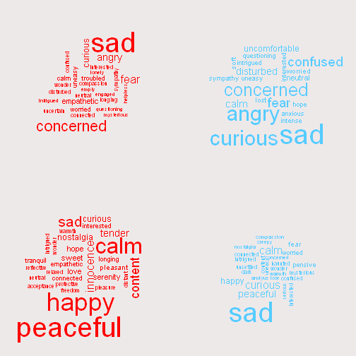
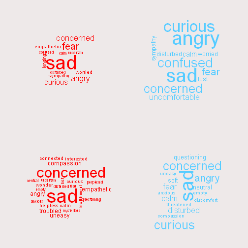
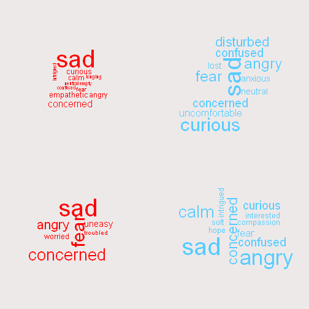
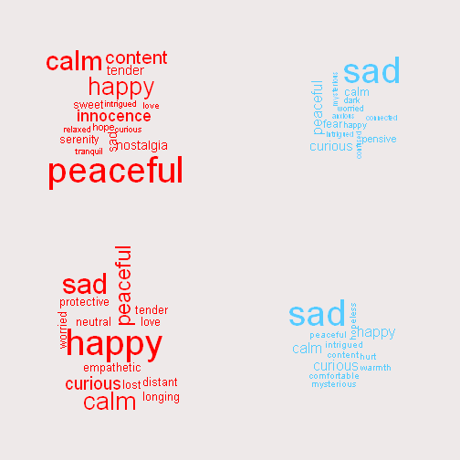

In the following, Red indicates a stronger positive reaction to Photo,
Cyan a stronger positive reaction to Weave, Purple an equal reaction.

When age groups are compared, younger is on the left, older is on the right

When comparing age groups, the line thicknesses are pro-rated to what
they would be if sample sizes were the same in both groups.  This makes
the difference in response a lot easier to see.

The images are presented overa stylized "Face" with light and dark regions vaguely similar to the photograps, so the impact of the colors, lines and shapes
could be more easily seen.  These graphs all enforce a 4/3 aspect ratio.

## Matplots

The matplots are looking good, and have the option of tweaking aspect ratio of the image or thickness of lines as desired.

### Pittsburgh, full data set

 

### Pittsburgh, under 50 (left) vs over 50 (right)

The difference here is that the right side has almost no blue,
the thicnkess of the blue lines are very narrow.

 

### Houston, full data set

 

### Houston, under 30 (left) vs over 30 (right)

Houston's under 30 subjects had a much more uniform response
than the other categories, which show in the very thick lines.

Again the older population is defined more by lack of much blue
than thick red lines - their exact response varied quite a bit.

 

## Spot Graphs

The spot sizes were prorated in the age group data sets to appear
the same relative size as if both populations were the same.

I think there probably is a better shape than "circle" for this
"hollow" versions of the various shapes are also possible but I think
if you go down that road the + or x or * shapes are probably better
and likely easier to weave.  I have a memory that diagonals are hard,
so the square or "+" shapes might be of interest.  

I believe the color coded tickmarks are superior than trying to put
a grid on as well, but as you had positive feedback from an artistic
standpoint on a gridline, I've included my favorite take on a gridline,
using the same color as the lighter portion of the photographic image,
allowing the gridline to blend into the image instead of dominating it..

Starts with just the spots like the original graphs, allowing focus on the
data differences and see how that ties in with what
the matplots show.  All of the graphical options are then listed
with a single plot, so they're easier to compare.

### Pittsburgh, full data set

 

### Pittsburgh, under 50 (left) vs over 50 (right)

 

### Houston, full data set

 

### Houston, under 30 (left) vs over 30 (right)

 

## Graphic options

Uses the Pittsburgh Spots full population as the example.

Thicknesses of lines on the +, x, * or other similar line-shapes
can be adjusted in my graphics program, I just went with the defaults
to illustrate the idea.  The sizing that was ok for spots might not
be right for a line-drawing (it might need to be bigger to show up
well if it isn't a solid shape).

### Gridlines

 
### Shapes

Some of the line shapes are interesting although they might be hard
to weave.  


```
## Warning in par(mfcol = c(1, 1), bg = "dimgrey", las = 1, col = "dimgrey", :
## "size" is not a graphical parameter
```

     

    

There were some interesting differences in the word choices, but
delving deeper into the text I found a number where more than one
emotion was present (eg, Anger and Loneliness) so these words 
are clearly just the more dominant of the two.

The lc_clean program performed scrubbing of similar words or synonyms to make the 
groupings easier to see (so Sad and Sadness were both mapped to Sad)

## Word Pairings

These are a few simple tables showing the largest shifts in
reaction by individual subjects.  A positive number indicates 
the Weave has a more positive response, a negative number 
indicates the Photo has a more positive response.

The idea of these charts is to see what changed emotionally during
the largest shifts.

### Pittsburgh Photo More Positive

```
##          Photo         Weave Change
## 238      happy           sad     -8
## 335    curious         empty     -8
## 171  expansion     disturbed     -7
## 198 mesmerized          fear     -7
## 353        sad          soft     -7
## 48   concerned          fear     -6
## 121       calm        blurry     -6
## 129    engaged uncomfortable     -6
## 147       calm           odd     -6
## 278    inquiry         alarm     -6
## 293        sad         aware     -6
## 296 empathetic   questioning     -6
## 318 mysterious       neutral     -6
## 356        sad       curious     -6
## 368  skeptical     resentful     -6
## 90  compassion       seeking     -5
## 111 protective       nervous     -5
## 125    exposed         guilt     -5
## 133    curious     apathetic     -5
## 144      angry         wrong     -5
```
### Pittsburgh Weave More Positive

```
##          Photo        Weave Change
## 120   troubled   reflective      8
## 265    worried   interested      8
## 134     desire         fear      7
## 338       fear     peaceful      7
## 91         sad         evil      6
## 54        lost    wondering      5
## 183     butter invigorating      5
## 282        sad    beautiful      5
## 280    wishing        angry      4
## 354     lonely          sad      4
## 387  uncertain         hope      4
## 396 reflective        angry      4
## 2       caring     confused      3
## 42         sad        angry      3
## 75        fear      curious      3
## 80        fear                   3
## 142     uneasy         fear      3
## 165     amazed    concerned      3
## 191 mysterious          sad      3
## 225       fear         help      3
```

### Houston Photo More Positive

```
##          Photo      Weave Change
## 20   innocence       fear     -8
## 45   innocence       fear     -8
## 52        calm       dark     -8
## 138      happy foreboding     -8
## 200  innocence       dark     -8
## 8    intrigued  concerned     -7
## 237 empathetic discomfort     -7
## 313  nostalgia    forlorn     -7
## 347  relective reflective     -7
## 411   charming        sad     -7
## 413      light  depressed     -7
## 1       warmth        awe     -6
## 17    pleasant        not     -6
## 24     charmed  disturbed     -6
## 40    peaceful       loss     -6
## 61   innocence  ambiguity     -6
## 135  nostalgia        sad     -6
## 153       calm       want     -6
## 171     tender    anxious     -6
## 360       calm mysterious     -6
```
### Houston Weave More Positive

```
##           Photo       Weave Change
## 102     guarded comfortable      7
## 43    nostalgia     distant      6
## 64       wonder     worried      6
## 233        blah     content      6
## 421        lost     content      6
## 78      impulse         sad      5
## 185     mandala   greatness      5
## 216    peaceful     secrets      5
## 339   perplexed         sad      5
## 57       tender   concerned      4
## 101         sad  interested      4
## 111    peaceful         sad      4
## 159    pleasure   unsettled      4
## 165      lovely   emergence      4
## 172       happy        lost      4
## 178     longing                  4
## 258        calm         sad      4
## 269  protective affirmation      4
## 387 questioning     haunted      4
## 415       happy    extended      4
```

## Wordclouds

In the following, we stay with the Red-Blue convention, using
Red for Photo Words and Blue for Weave Words.

All of these plots are 4x4, with left side Photo, right side Word,
top and bottom being something different, as indicated by labels.

When sample sizes are different, the smaller samples are pro-rated
so size will be similar in both sets of graphs

### Pittsburgh (top) vs Houston (bottom)

```
## Warning: package 'wordcloud' was built under R version 3.2.3
```

```
## Loading required package: RColorBrewer
```

```
## Warning: package 'tm' was built under R version 3.2.3
```

```
## Loading required package: NLP
```

 

### Pittsburgh under 50 (top) vs 50+ (bottom)
 

### Houston under 30 (top) vs 30+ (bottom)
 

### Pittsburgh Weave more Negative (top) vs Weave More Positive (bottom)
 

### Houston Weave more Negative (top) vs Weave More Positive (bottom)
 


